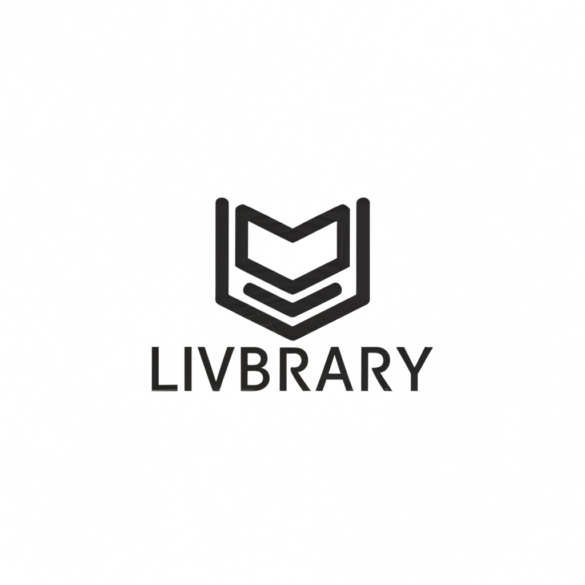

<h2 align="center">  LIVbrary : A Comprehensive Web App for Library Management </h2>

<h1 align="center">

   
   
   
   
   
   
   


</h1>

<p align="center">   
   
   
   
</p>

**Welcome to LIVbrary, a feature-rich web application designed to streamline library operations and enhance the user experience for both patrons and administrators!**

**Key Features**

* **User Management:**

    * Users can request books from the admin.
    * Browse and read ebooks in PDF format from their bookshelf (with a maximum of 5 books at a time).  
    * Maintain a bookshelf with a 7-day loan period. Requested books are automatically revoked after 7 days to maintain circulation. 
    * Search for books by title, author, or genre using a convenient search functionality. 
    * Keep track of favorite books for easy access. 
    * Add notes to books for personal reference. 
    * Choose a colorful avatar to personalize their experience. 
    * Receive email alerts if they don't log in daily to stay engaged (optional). 
    * Get a monthly report via email with a PDF attachment summarizing their library activity (books returned, issued, logged-in timestamps).

* **Admin Management:**

    * Create, Read, Update, and Delete (CRUD) functionalities for genres, books, user requests, and overdue books. 
    * Manage the library's collection efficiently.

* **Advanced Functionalities:**

    * **Asynchronous Tasks:** Leverage Celery and Redis for background tasks, ensuring a smooth user experience. 
    * **Email Notifications:** An integrated mail client sends automated email alerts and reports. 
    * **Customizable Reports:**  Generate PDF reports containing library activity details using PDFKit. 
    * **News Updates:** Stay informed! Access current news headlines in PDF format based on your region. News updates are refreshed asynchronously every three hours.

**Technical Stack**

* Backend:
    * Flask RESTX  - API framework for robust backend development.
    * Swagger UI - User-friendly interface for API documentation.
    * SQLAlchemy - Powerful object-relational mapper (ORM) for database interactions.
    * Flask-Caching, Celery, Redis - Tools for efficient caching and asynchronous tasks.
    * Custom SMTP Server - Handles email communication.
    * JWT Tokens - Secure user authentication and RBAC.
* Frontend:
    * Vue.js 2 - Modern JavaScript framework for a dynamic and interactive user interface.
    * Bootstrap - Popular CSS framework for responsive design.
    * Jinja2 - Template engine for server-side rendering.
    * Axios/Fetch - HTTP libraries for seamless communication between the frontend and the backend.
    * Matplotlib - Python library for data visualization (charts and analytics).
* Security:
    * HTTPS enforced using self-signed certificates for secure communication.

---

**Getting Started (For Developers)**


1.  Clone this repository
   
   ```
      git clone https://github.com/dedWalker18/livbrary.git
   ```

2.  Install Prerequisites

   ```
      pip install -r requirements.txt
   ```

3. Navigate to Backend and run the following command in a terminal. (certificates optional)

```
   flask run --host=0.0.0.0 --debug

   flask run --host=0.0.0.0 --debug --cert=cert.pem --key=key.pem
```

4.  Run Celery and Connect to a Redis-Server. Run each command in a separate terminal.
   
   ```
      redis-server
    
      celery -A app.celery worker --loglevel=info
    
      celery -A app.celery beat --loglevel=info
   ```

5. Navigate to Frontend and run the following command in a separate terminal.
   
```
   npm I

   npm run serve
```


6. You can use Mailhog inside docker to test the mail client.
   Alternatively, you can use FastMail or other services.

```
   docker run -d -p 1025:1025 -p 8025:8025 mailhog/mailhog
```

---

*OPTIONAL -  run feeder.py file to feed fodder data to the application.*
   
**Make sure to expose free ports on your network if the predefined ports are already busy.**

**Conclusion**

LIVbrary provides a comprehensive solution for managing libraries and enhancing the user experience. Its feature-rich design caters to both patrons and administrators, streamlining workflows and fostering a love for reading!

---
